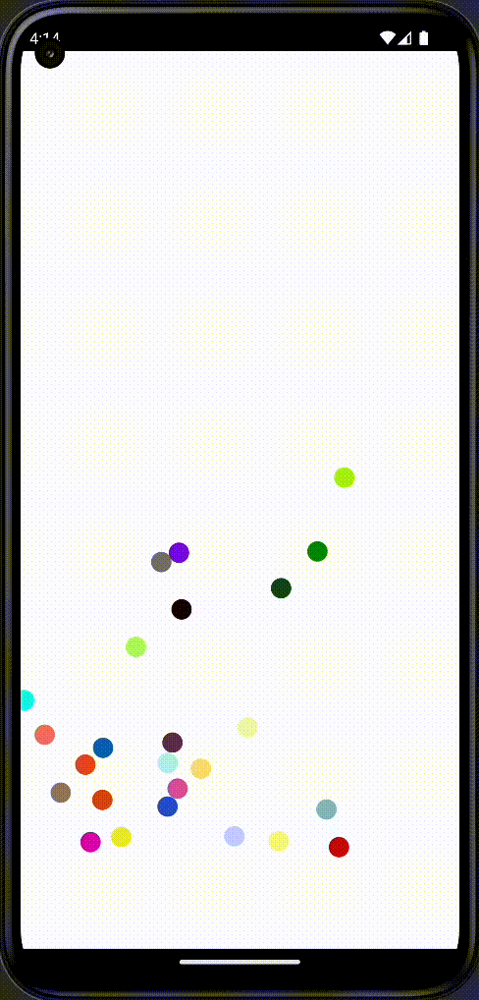

# ecs-kmm
Entity component system example based on KMM based on [building-an-ecs-in-kotlin-mpp](https://avwie.github.io/building-an-ecs-in-kotlin-mpp)

What is ECS briefly:
1) ECS comprises entities composed from components of data, with systems which operate on entities' components. Mostly used in game development
2) In this example and typically an entity is represented by a trivial Id
3) Component represents, poses and holds data to represent a particular aspect such as health or just a color
4) Finally the system acts on entities with desired components. For ex. the gravity system may query entities with mass, velocity and position components doing physics calculations. Another example is the system that queries entities with velocity and position and makes sure that position does not go out of the bottom line of the screen by inverting the velocity.
As you may notice this design approach is modular which allows to easily maintain or even replace one particular module. Which in turn allows to easily change the behavior of the whole system.

What is interesting to notice regarding Kotlin/KMM:

1) Platform specific code resides in PlatformUtils for iOS/Android. API such as random number generating or time related functions is implemented in platform specific files: androidMain/PlatformUtils.kt and iosMain/PlatformUtils.kt. Notice that both files are written in Kotlin language. At the same time a shared part is located in commonMain

2) How generic functions are specialized using the extension:

```kotlin
data class Rectangle<T>(val origin: Vector2D<T>, val width: T, val height: T)

fun Rectangle<Double>.contains(point: Vector2D<Double>): Boolean =
    point.x > origin.x && point.x < origin.x + width &&
            point.y > origin.y && point.y < origin.y + height

origin.x is Double in this case
```

Usage:
```kotlin
val bounds = Rectangle(Vector2D(0.0, 0.0), width, height)
// Even though a Rectangle type is generic the compiler can infer a Double type out of parameters type and uses contains() defined for Double type
bounds.contains(Vector2D(0.0, 0.0))
```

The same applies to operators:
```kotlin
data class Vector2D<T>(val x: T, val y: T)
operator fun Vector2D<Double>.plus(increment: Vector2D<Double>): Vector2D<Double> =
    Vector2D(x + increment.x, y + increment.y)
```
Usage:
```kotlin
velocity += acceleration * dt
```

3) How components and entities are identified:
```kotlin
interface Component<C> {
    val key: ComponentKey<C>
}

override fun <C> get(id: Id, key: ComponentKey<C>)
```


4) Thanks to KMM almost all code resides in a shared part which makes easier to maintain it

5) Let's try to brake this app to deliver incorrect results by changing a container type for objects being drawn. Let's use MutableList and clear() function. The branch name is *reuse-list*. As a workaround we can define a simple text and update it from the same place where we are generating drawing objects. The branch name is *fixup-reuse-list*.

